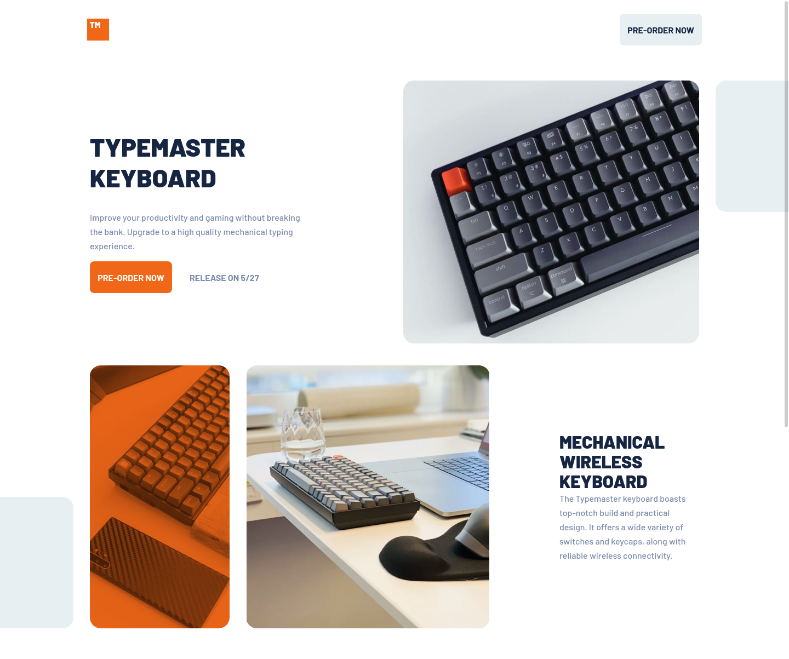

# Frontend Mentor - Typemaster pre-launch landing page solution

This is a solution to the [Typemaster pre-launch landing page challenge on Frontend Mentor](https://www.frontendmentor.io/challenges/typemaster-prelaunch-landing-page-J6-Yj5J-X). Frontend Mentor challenges help you improve your coding skills by building realistic projects.

## Table of contents

- [Frontend Mentor - Typemaster pre-launch landing page solution](#frontend-mentor---typemaster-pre-launch-landing-page-solution)
  - [Table of contents](#table-of-contents)
  - [Overview](#overview)
    - [The challenge](#the-challenge)
    - [Running](#running)
    - [Screenshot](#screenshot)
    - [Links](#links)
  - [My process](#my-process)
    - [Built with](#built-with)
    - [What I learned](#what-i-learned)
    - [Continued development](#continued-development)
    - [Useful resources](#useful-resources)
  - [Author](#author)
  - [Acknowledgments](#acknowledgments)

**Note: Delete this note and update the table of contents based on what sections you keep.**

## Overview

### The challenge

Accomodate elements based on a given design in Figma using HTML and CSS.

### Running

Clone this repository then run npm install

```
npm install
```

To start a dev server run:

```
npm start
```

To get a build for production run:

```
npm run build
```

### Screenshot



### Links

- Solution URL: [Hector Lopez' repository](https://github.com/hec-lopz/typemaster-landing-page)
- Live Site URL: [Add live site URL here](https://your-live-site-url.com)

## My process

### Built with

- Semantic HTML5 markup
- [Stylus](https://github.com/stylus/stylus/tree/dev/docs)
- Flexbox
- CSS Grid
- Mobile-first workflow
- [Webpack](https://webpack.js.org/)
- Responsive Web Design
- HTML Resposive images
- [BEM](http://getbem.com/)

### What I learned

At the beggining I thought of doing the hero section with CSS grid, however I decided that using it could require more code and time spent in order to have it properly positioned. I chose to use CSS flexbox instead, as there are no repetitive items in this section, grid's functionalities would not be missed.

I tried my best on organizing my files the best possible, on a way I imagine a bigger project would use. Styles files are divided by section and each section has separated media queries. I also used BEM for naming my classes, which made my stylus files to be easier to read.

I decided to use webpack in order to optimize the project, despite I don´t use much JavaScript I still can take advantage of its ability to process images and files.

### Continued development

I would like to improve semantic HTML, also I would like to learn more about accessibility.

### Useful resources

- [BEM: la mejor manera de nombrar tus clases de HTML](https://platzi.com/tutoriales/2008-html-css/7858-bem-la-mejor-manera-de-nombrar-tus-clases-de-html/) - This is an article I wrote about how to implement BEM, this is the thinking process I make to name my classes.
- [A Complete Guide to Flexbox](https://css-tricks.com/snippets/css/a-guide-to-flexbox/#flexbox-properties) - This is the resource I check everytime I have to use Flexbox.
- [A Complete Guide to Grid](https://css-tricks.com/snippets/css/complete-guide-grid/) - Same case for CSS Grid.

## Author

- Website - [Hector Lopez' portfolio](https://heclopz.netlify.app/)
- Frontend Mentor - [@hec-lopz frontend mentor profile](https://www.frontendmentor.io/profile/hec-lopz)
- Twitter - [@yhec_lopz](https://www.twitter.com/hec_lopz)

## Acknowledgments

[Alex Camacho](https://github.com/alexcamachogz) - She helped me to decide whether or not to use css grid for the hero section.
